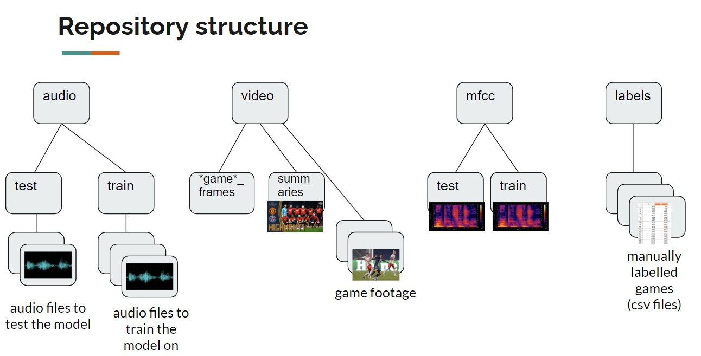

# sports_highlights

Detecting sports highlights using audio cues.

## Getting Started

### Prerequisites
All needed Python modules and their versions are in the requirements.txt file.

LINK TO DATA: https://drive.google.com/drive/folders/1j9lvsAsphmYoS9KrQ5brehSR2aB1UwL5?usp=sharing

**For every file refering to a game, it is crucial that the name string (i.e. the name of the game) is the same for every file.**
Example: for **PSGvSCO** game, audio track is named 'PSGvSCO.mp3', video file is named 'PSGvSCO.mp4', labels file is called 'PSGvSCO.csv'
By default, the algorithm will only scan games stored in video/ folder.

Training audio samples must be put under audio/train/ and match the game footage under video/.
Game footage must be put under video/. Summaries must be put under video/summaries/.
Labels referung to audio files must be put under labels/.

## Running the code
In a terminal, run:

    python3 main.py -t <0 or 1> -g <0 or 1> -m <0 or 1> -a <path to test audio>

mandatory arguments:

<-t>: defines whether or not training will be performed. Possible values: 1 (yes) or 0 (no)

<-g>: defines if algorithm must generate Ground-Truth from video comparison. If yes, a list of highlights will be stored in a .csv file in labels/groundtruth/. Possible values: 1 (yes) or 0 (no)

<-m>: defines if algorithm re-generates mfcc spectrograms of the training dataset. If yes, spectrograms are stored as .pkl files under mfcc/train/. Possible values: 1 (yes) or 0 (no)

<-a>: path to test audio

## Remarks

The video_utils.py file contains code to build a video file from the predicted highlights.

## Author

Maximilien Gomart - maximilien.gomart@epfl.ch

## Acknowledgments

AudioVisual Communications Lab (LCAV) @ EPFL
Prof. Adam Scholefield
Eric Bezzam
